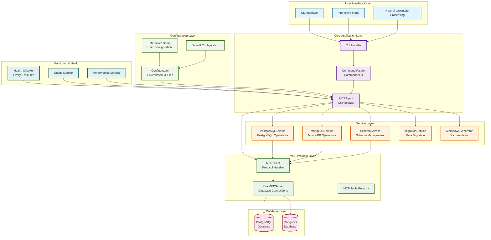
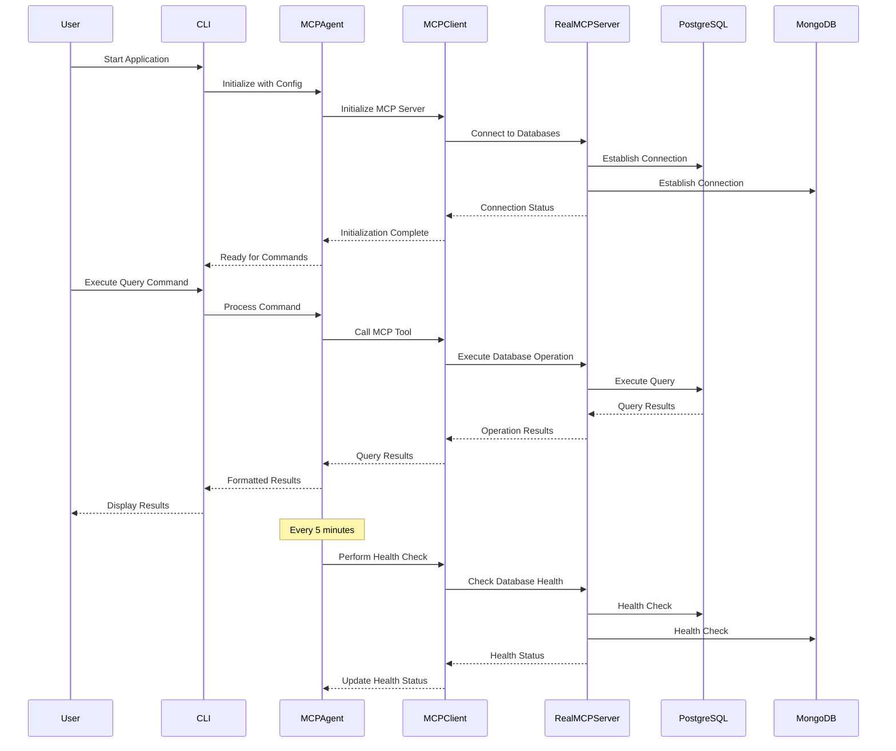
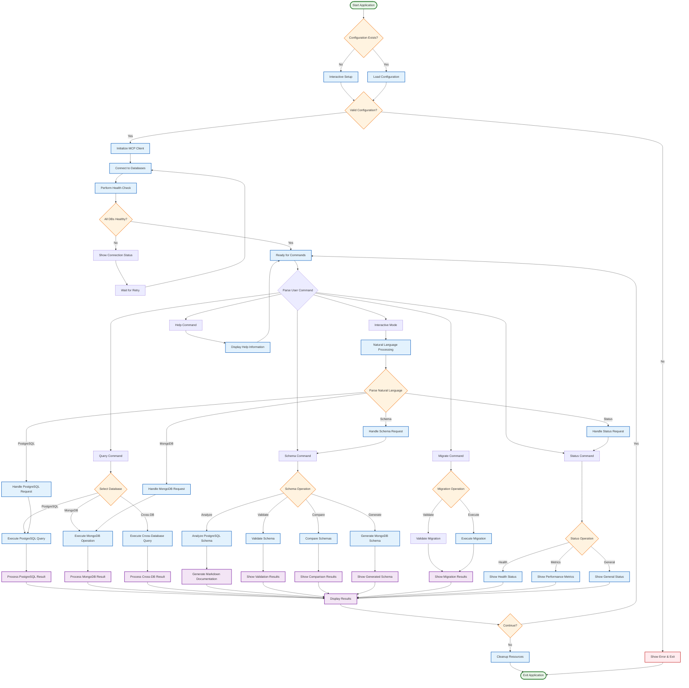
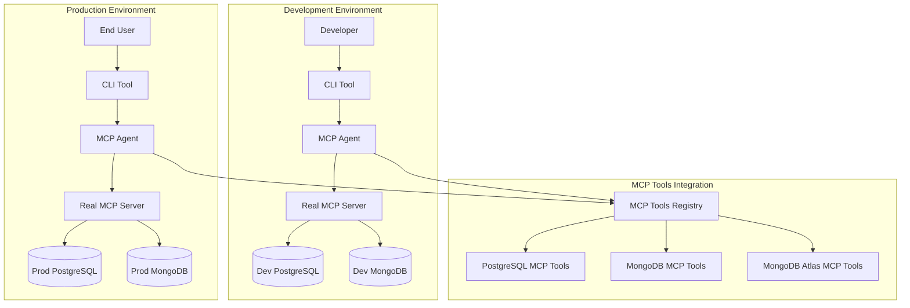

# 🏗️ MCP Database Agent - Architecture Diagram

## 📊 **System Architecture Overview**

## 🔄 **Data Flow Architecture**

## 🔀 **Application Flow Diagram**

## 🔄 **Natural Language Processing Flow**

```mermaid
flowchart TD
    USER_INPUT[User Natural Language Input] --> INPUT_PARSER[Input Parser]
    
    INPUT_PARSER --> PATTERN_MATCH{Pattern Matching}
    
    PATTERN_MATCH -->|PostgreSQL| PG_PATTERN[PostgreSQL Pattern Detected]
    PATTERN_MATCH -->|MongoDB| MONGO_PATTERN[MongoDB Pattern Detected]
    PATTERN_MATCH -->|Schema| SCHEMA_PATTERN[Schema Pattern Detected]
    PATTERN_MATCH -->|Status| STATUS_PATTERN[Status Pattern Detected]
    PATTERN_MATCH -->|Unknown| HELP_PATTERN[Show Help & Examples]
    
    %% PostgreSQL Pattern Processing
    PG_PATTERN --> PG_OPERATION{Operation Type}
    PG_OPERATION -->|UPDATE| PG_UPDATE[Parse UPDATE Operation]
    PG_OPERATION -->|DELETE| PG_DELETE[Parse DELETE Operation]
    PG_OPERATION -->|FETCH| PG_FETCH[Parse FETCH Operation]
    PG_OPERATION -->|COUNT| PG_COUNT[Parse COUNT Operation]
    
    PG_UPDATE --> PG_UPDATE_SQL[Generate UPDATE SQL]
    PG_DELETE --> PG_DELETE_SQL[Generate DELETE SQL]
    PG_FETCH --> PG_FETCH_SQL[Generate SELECT SQL]
    PG_COUNT --> PG_COUNT_SQL[Generate COUNT SQL]
    
    PG_UPDATE_SQL --> PG_EXECUTE[Execute PostgreSQL Query]
    PG_DELETE_SQL --> PG_EXECUTE
    PG_FETCH_SQL --> PG_EXECUTE
    PG_COUNT_SQL --> PG_EXECUTE
    
    %% MongoDB Pattern Processing
    MONGO_PATTERN --> MONGO_OPERATION{Operation Type}
    MONGO_OPERATION -->|UPDATE| MONGO_UPDATE[Parse UPDATE Operation]
    MONGO_OPERATION -->|DELETE| MONGO_DELETE[Parse DELETE Operation]
    MONGO_OPERATION -->|FETCH| MONGO_FETCH[Parse FETCH Operation]
    MONGO_OPERATION -->|COUNT| MONGO_COUNT[Parse COUNT Operation]
    
    MONGO_UPDATE --> MONGO_UPDATE_OP[Generate MongoDB Update]
    MONGO_DELETE --> MONGO_DELETE_OP[Generate MongoDB Delete]
    MONGO_FETCH --> MONGO_FETCH_OP[Generate MongoDB Find]
    MONGO_COUNT --> MONGO_COUNT_OP[Generate MongoDB Count]
    
    MONGO_UPDATE_OP --> MONGO_EXECUTE[Execute MongoDB Operation]
    MONGO_DELETE_OP --> MONGO_EXECUTE
    MONGO_FETCH_OP --> MONGO_EXECUTE
    MONGO_COUNT_OP --> MONGO_EXECUTE
    
    %% Schema Pattern Processing
    SCHEMA_PATTERN --> SCHEMA_OPERATION{Schema Operation}
    SCHEMA_OPERATION -->|Analyze| SCHEMA_ANALYZE[Trigger Schema Analysis]
    SCHEMA_OPERATION -->|Compare| SCHEMA_COMPARE[Trigger Schema Comparison]
    SCHEMA_OPERATION -->|Validate| SCHEMA_VALIDATE[Trigger Schema Validation]
    
    SCHEMA_ANALYZE --> SCHEMA_CMD
    SCHEMA_COMPARE --> SCHEMA_CMD
    SCHEMA_VALIDATE --> SCHEMA_CMD
    
    %% Status Pattern Processing
    STATUS_PATTERN --> STATUS_OPERATION{Status Operation}
    STATUS_OPERATION -->|Health| STATUS_HEALTH[Trigger Health Check]
    STATUS_OPERATION -->|Metrics| STATUS_METRICS[Trigger Performance Metrics]
    STATUS_OPERATION -->|General| STATUS_GENERAL[Show General Status]
    
    STATUS_HEALTH --> STATUS_CMD
    STATUS_METRICS --> STATUS_CMD
    STATUS_GENERAL --> STATUS_CMD
    
    %% Execution and Results
    PG_EXECUTE --> PG_RESULT_PROCESS[Process PostgreSQL Results]
    MONGO_EXECUTE --> MONGO_RESULT_PROCESS[Process MongoDB Results]
    
    PG_RESULT_PROCESS --> FORMAT_RESULT[Format Results]
    MONGO_RESULT_PROCESS --> FORMAT_RESULT
    
    FORMAT_RESULT --> DISPLAY_USER[Display to User]
    HELP_PATTERN --> DISPLAY_USER
    
    %% Error Handling
    PG_EXECUTE --> PG_ERROR{Success?}
    MONGO_EXECUTE --> MONGO_ERROR{Success?}
    
    PG_ERROR -->|No| PG_ERROR_HANDLE[Handle PostgreSQL Error]
    MONGO_ERROR -->|No| MONGO_ERROR_HANDLE[Handle MongoDB Error]
    
    PG_ERROR_HANDLE --> DISPLAY_USER
    MONGO_ERROR_HANDLE --> DISPLAY_USER
    
    %% Styling
    classDef input fill:#e8f5e8,stroke:#2e7d32,stroke-width:2px
    classDef process fill:#e3f2fd,stroke:#1565c0,stroke-width:2px
    classDef decision fill:#fff3e0,stroke:#ef6c00,stroke-width:2px
    classDef result fill:#f3e5f5,stroke:#7b1fa2,stroke-width:2px
    classDef error fill:#ffebee,stroke:#c62828,stroke-width:2px
    
    class USER_INPUT input
    class INPUT_PARSER,PG_PATTERN,MONGO_PATTERN,SCHEMA_PATTERN,STATUS_PATTERN,PG_UPDATE,PG_DELETE,PG_FETCH,PG_COUNT,MONGO_UPDATE,MONGO_DELETE,MONGO_FETCH,MONGO_COUNT,SCHEMA_ANALYZE,SCHEMA_COMPARE,SCHEMA_VALIDATE,STATUS_HEALTH,STATUS_METRICS,STATUS_GENERAL,PG_EXECUTE,MONGO_EXECUTE,PG_RESULT_PROCESS,MONGO_RESULT_PROCESS,FORMAT_RESULT,DISPLAY_USER process
    class PATTERN_MATCH,PG_OPERATION,MONGO_OPERATION,SCHEMA_OPERATION,STATUS_OPERATION,PG_ERROR,MONGO_ERROR decision
    class PG_UPDATE_SQL,PG_DELETE_SQL,PG_FETCH_SQL,PG_COUNT_SQL,MONGO_UPDATE_OP,MONGO_DELETE_OP,MONGO_FETCH_OP,MONGO_COUNT_OP,SCHEMA_CMD,STATUS_CMD result
    class PG_ERROR_HANDLE,MONGO_ERROR_HANDLE,HELP_PATTERN error
```

## 🔧 **MCP Tools Architecture**

```mermaid
graph TB
    subgraph "MCP Tools Available"
        subgraph "PostgreSQL MCP Tools"
            PG_READ[mcp_postgresql_read_query]
            PG_WRITE[mcp_postgresql_write_query]
            PG_TABLES[mcp_postgresql_list_tables]
            PG_DESCRIBE[mcp_postgresql_describe_table]
            PG_CREATE[mcp_postgresql_create_table]
            PG_ALTER[mcp_postgresql_alter_table]
            PG_DROP[mcp_postgresql_drop_table]
            PG_EXPORT[mcp_postgresql_export_query]
        end
        
        subgraph "MongoDB MCP Tools"
            MONGO_CONNECT[mcp_MongoDB_connect]
            MONGO_DBS[mcp_MongoDB_list-databases]
            MONGO_COLLECTIONS[mcp_MongoDB_list-collections]
            MONGO_FIND[mcp_MongoDB_find]
            MONGO_INSERT[mcp_MongoDB_insert-many]
            MONGO_UPDATE[mcp_MongoDB_update-many]
            MONGO_DELETE[mcp_MongoDB_delete-many]
            MONGO_COUNT[mcp_MongoDB_count]
            MONGO_AGGREGATE[mcp_MongoDB_aggregate]
        end
        
        subgraph "MongoDB Atlas MCP Tools"
            ATLAS_CLUSTERS[mcp_MongoDB_atlas-list-clusters]
            ATLAS_PROJECTS[mcp_MongoDB_atlas-list-projects]
            ATLAS_CREATE_CLUSTER[mcp_MongoDB_atlas-create-free-cluster]
            ATLAS_CONNECT[mcp_MongoDB_atlas-connect-cluster]
        end
    end

    subgraph "Tool Usage Flow"
        USER_REQUEST[User Request]
        TOOL_SELECTION[Tool Selection]
        PARAMETER_MAPPING[Parameter Mapping]
        EXECUTION[Tool Execution]
        RESULT_PROCESSING[Result Processing]
    end

    USER_REQUEST --> TOOL_SELECTION
    TOOL_SELECTION --> PARAMETER_MAPPING
    PARAMETER_MAPPING --> EXECUTION
    EXECUTION --> RESULT_PROCESSING

    %% Tool connections
    TOOL_SELECTION --> PG_READ
    TOOL_SELECTION --> PG_WRITE
    TOOL_SELECTION --> MONGO_FIND
    TOOL_SELECTION --> MONGO_INSERT
    TOOL_SELECTION --> ATLAS_CLUSTERS
```

## 📁 **File Structure Architecture**

```mermaid
graph TD
    ROOT[cursor-database/]
    
    ROOT --> SRC[src/]
    ROOT --> SCRIPTS[scripts/]
    ROOT --> CONFIG_FILES[Configuration Files]
    
    SRC --> CORE[core/]
    SRC --> SERVICES[services/]
    SRC --> CLI[cli/]
    SRC --> CONFIG[config/]
    SRC --> SERVER[server/]
    SRC --> TYPES[types/]
    SRC --> INDEX[index.ts]
    
    CORE --> MCP_AGENT[MCPAgent.ts]
    CORE --> MCP_CLIENT[MCPClient.ts]
    CORE --> MCP_BRIDGE[MCPBridge.ts]
    
    SERVICES --> POSTGRES_SERVICE[PostgreSQLService.ts]
    SERVICES --> MONGO_SERVICE[MongoDBService.ts]
    SERVICES --> SCHEMA_SERVICE[SchemaService.ts]
    SERVICES --> MIGRATION_SERVICE[MigrationService.ts]
    SERVICES --> MARKDOWN_GEN[MarkdownGenerator.ts]
    
    CLI --> CLI_MAIN[CLI.ts]
    
    CONFIG --> CONFIG_LOADER[config-loader.ts]
    CONFIG --> DEFAULT_CONFIG[default-config.ts]
    CONFIG --> INTERACTIVE_SETUP[interactive-setup.ts]
    
    SERVER --> REAL_MCP_SERVER[RealMCPServer.ts]
    
    TYPES --> INDEX_TYPES[index.ts]
    
    CONFIG_FILES --> ENV_TEMPLATE[env.template]
    CONFIG_FILES --> ENV_EXAMPLE[env.example]
    CONFIG_FILES --> MCP_CONFIG[mcp-config.json]
    
    SCRIPTS --> SETUP_ENV[setup-env.sh]
```

## 🚀 **Deployment Architecture**

## 🔍 **Key Architectural Patterns**

### **1. MCP-First Architecture**
- **No Direct Database Connections**: All operations go through MCP tools
- **Protocol Abstraction**: Database operations abstracted via MCP protocol
- **Tool Registry**: Centralized MCP tools management

### **2. Service-Oriented Architecture**
- **Separation of Concerns**: Each database type has dedicated service
- **Service Orchestration**: MCPAgent coordinates between services
- **Loose Coupling**: Services communicate through well-defined interfaces

### **3. Command Pattern**
- **CLI Commands**: Structured command processing via Commander.js
- **Natural Language**: Human-readable commands converted to operations
- **Interactive Mode**: Real-time command processing

### **4. Factory Pattern**
- **Service Creation**: Services instantiated based on configuration
- **Connection Management**: Database connections managed centrally
- **Configuration Loading**: Multiple configuration sources supported

### **5. Observer Pattern**
- **Health Monitoring**: Continuous health status updates
- **Status Tracking**: Real-time database connection status
- **Performance Metrics**: Ongoing performance monitoring

## 🎯 **Architecture Benefits**

1. **Scalability**: Easy to add new database types via MCP tools
2. **Maintainability**: Clear separation of concerns and modular design
3. **Flexibility**: Configuration-driven behavior and MCP tool integration
4. **Reliability**: Health monitoring, retry logic, and error handling
5. **User Experience**: Natural language processing and interactive CLI
6. **Standards Compliance**: Built on MCP protocol standards

This architecture provides a robust, scalable, and maintainable foundation for database orchestration through the Model Context Protocol.
