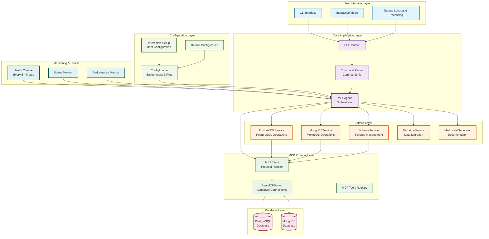
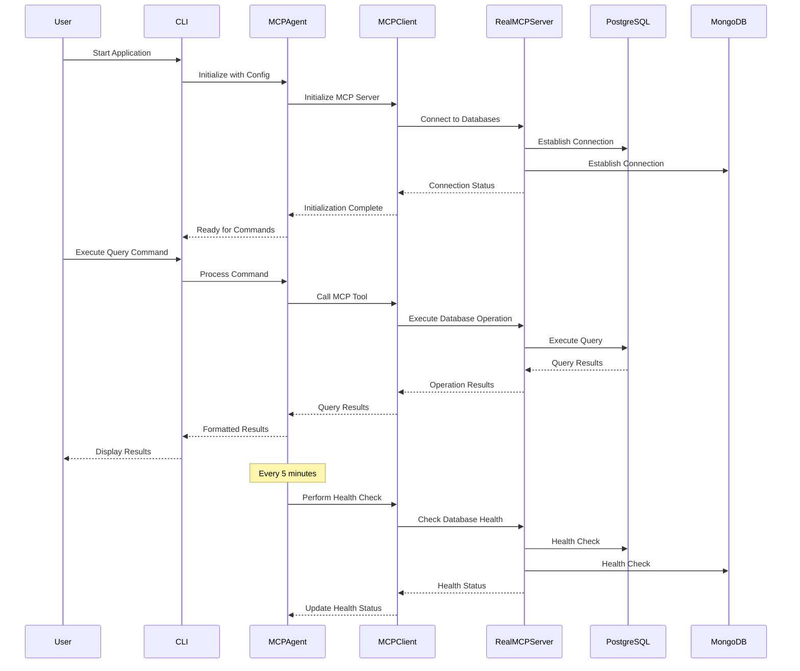
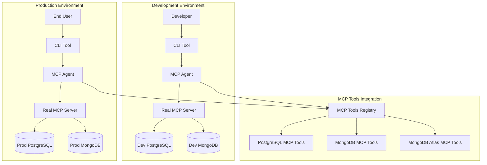

# 🏗️ MCP Database Agent - Architecture Diagram

## 📊 **System Architecture Overview**



## 🔄 **Data Flow Architecture**



## 🏛️ **Component Architecture**

```mermaid
graph LR
    subgraph "Entry Point"
        INDEX[index.ts<br/>Main Entry Point]
        MAIN[main() Function]
        CONFIG_LOAD[Configuration Loading]
    end

    subgraph "CLI Layer"
        CLI_CLASS[CLI Class]
        COMMANDS[Command Definitions]
        INTERACTIVE_MODE[Interactive Mode]
        NATURAL_LANG[Natural Language Handler]
    end

    subgraph "Core Layer"
        MCP_AGENT_CORE[MCPAgent Class]
        INITIALIZATION[Initialization Logic]
        ORCHESTRATION[Service Orchestration]
        STATUS_MGMT[Status Management]
    end

    subgraph "MCP Layer"
        MCP_CLIENT_CORE[MCPClient Class]
        TOOL_CALLS[MCP Tool Calls]
        HEALTH_MONITOR[Health Monitoring]
        RETRY_LOGIC[Retry Logic]
    end

    subgraph "Server Layer"
        REAL_MCP_SERVER_CORE[RealMCPServer Class]
        POSTGRES_CONN[PostgreSQL Connection]
        MONGO_CONN[MongoDB Connection]
        CONNECTION_MGMT[Connection Management]
    end

    subgraph "Service Layer"
        POSTGRES_SVC[PostgreSQLService]
        MONGO_SVC[MongoDBService]
        SCHEMA_SVC[SchemaService]
        MIGRATION_SVC[MigrationService]
        MARKDOWN_SVC[MarkdownGenerator]
    end

    subgraph "Configuration Layer"
        CONFIG_LOADER_CORE[ConfigLoader]
        INTERACTIVE_SETUP_CORE[Interactive Setup]
        DEFAULT_CONFIG_CORE[Default Config]
        ENV_VARS[Environment Variables]
    end

    %% Connections
    INDEX --> MAIN
    MAIN --> CONFIG_LOAD
    CONFIG_LOAD --> CLI_CLASS
    
    CLI_CLASS --> COMMANDS
    CLI_CLASS --> INTERACTIVE_MODE
    CLI_CLASS --> NATURAL_LANG
    
    CLI_CLASS --> MCP_AGENT_CORE
    MCP_AGENT_CORE --> INITIALIZATION
    MCP_AGENT_CORE --> ORCHESTRATION
    MCP_AGENT_CORE --> STATUS_MGMT
    
    MCP_AGENT_CORE --> MCP_CLIENT_CORE
    MCP_CLIENT_CORE --> TOOL_CALLS
    MCP_CLIENT_CORE --> HEALTH_MONITOR
    MCP_CLIENT_CORE --> RETRY_LOGIC
    
    MCP_CLIENT_CORE --> REAL_MCP_SERVER_CORE
    REAL_MCP_SERVER_CORE --> POSTGRES_CONN
    REAL_MCP_SERVER_CORE --> MONGO_CONN
    REAL_MCP_SERVER_CORE --> CONNECTION_MGMT
    
    MCP_AGENT_CORE --> POSTGRES_SVC
    MCP_AGENT_CORE --> MONGO_SVC
    MCP_AGENT_CORE --> SCHEMA_SVC
    MCP_AGENT_CORE --> MIGRATION_SVC
    MCP_AGENT_CORE --> MARKDOWN_SVC
    
    CONFIG_LOAD --> CONFIG_LOADER_CORE
    CONFIG_LOADER_CORE --> INTERACTIVE_SETUP_CORE
    CONFIG_LOADER_CORE --> DEFAULT_CONFIG_CORE
    CONFIG_LOADER_CORE --> ENV_VARS
```

## 🔧 **MCP Tools Architecture**



```mermaid
graph TB
    subgraph "MCP Tools Available"
        subgraph "PostgreSQL MCP Tools"
            PG_READ[mcp_postgresql_read_query]
            PG_WRITE[mcp_postgresql_write_query]
            PG_TABLES[mcp_postgresql_list_tables]
            PG_DESCRIBE[mcp_postgresql_describe_table]
            PG_CREATE[mcp_postgresql_create_table]
            PG_ALTER[mcp_postgresql_alter_table]
            PG_DROP[mcp_postgresql_drop_table]
            PG_EXPORT[mcp_postgresql_export_query]
        end
        
        subgraph "MongoDB MCP Tools"
            MONGO_CONNECT[mcp_MongoDB_connect]
            MONGO_DBS[mcp_MongoDB_list-databases]
            MONGO_COLLECTIONS[mcp_MongoDB_list-collections]
            MONGO_FIND[mcp_MongoDB_find]
            MONGO_INSERT[mcp_MongoDB_insert-many]
            MONGO_UPDATE[mcp_MongoDB_update-many]
            MONGO_DELETE[mcp_MongoDB_delete-many]
            MONGO_COUNT[mcp_MongoDB_count]
            MONGO_AGGREGATE[mcp_MongoDB_aggregate]
        end
        
        subgraph "MongoDB Atlas MCP Tools"
            ATLAS_CLUSTERS[mcp_MongoDB_atlas-list-clusters]
            ATLAS_PROJECTS[mcp_MongoDB_atlas-list-projects]
            ATLAS_CREATE_CLUSTER[mcp_MongoDB_atlas-create-free-cluster]
            ATLAS_CONNECT[mcp_MongoDB_atlas-connect-cluster]
        end
    end

    subgraph "Tool Usage Flow"
        USER_REQUEST[User Request]
        TOOL_SELECTION[Tool Selection]
        PARAMETER_MAPPING[Parameter Mapping]
        EXECUTION[Tool Execution]
        RESULT_PROCESSING[Result Processing]
    end

    USER_REQUEST --> TOOL_SELECTION
    TOOL_SELECTION --> PARAMETER_MAPPING
    PARAMETER_MAPPING --> EXECUTION
    EXECUTION --> RESULT_PROCESSING

    %% Tool connections
    TOOL_SELECTION --> PG_READ
    TOOL_SELECTION --> PG_WRITE
    TOOL_SELECTION --> MONGO_FIND
    TOOL_SELECTION --> MONGO_INSERT
    TOOL_SELECTION --> ATLAS_CLUSTERS
```

## 📁 **File Structure Architecture**

```mermaid
graph TD
    ROOT[cursor-database/]
    
    ROOT --> SRC[src/]
    ROOT --> SCRIPTS[scripts/]
    ROOT --> CONFIG_FILES[Configuration Files]
    
    SRC --> CORE[core/]
    SRC --> SERVICES[services/]
    SRC --> CLI[cli/]
    SRC --> CONFIG[config/]
    SRC --> SERVER[server/]
    SRC --> TYPES[types/]
    SRC --> INDEX[index.ts]
    
    CORE --> MCP_AGENT[MCPAgent.ts]
    CORE --> MCP_CLIENT[MCPClient.ts]
    CORE --> MCP_BRIDGE[MCPBridge.ts]
    
    SERVICES --> POSTGRES_SERVICE[PostgreSQLService.ts]
    SERVICES --> MONGO_SERVICE[MongoDBService.ts]
    SERVICES --> SCHEMA_SERVICE[SchemaService.ts]
    SERVICES --> MIGRATION_SERVICE[MigrationService.ts]
    SERVICES --> MARKDOWN_GEN[MarkdownGenerator.ts]
    
    CLI --> CLI_MAIN[CLI.ts]
    
    CONFIG --> CONFIG_LOADER[config-loader.ts]
    CONFIG --> DEFAULT_CONFIG[default-config.ts]
    CONFIG --> INTERACTIVE_SETUP[interactive-setup.ts]
    
    SERVER --> REAL_MCP_SERVER[RealMCPServer.ts]
    
    TYPES --> INDEX_TYPES[index.ts]
    
    CONFIG_FILES --> ENV_TEMPLATE[env.template]
    CONFIG_FILES --> ENV_EXAMPLE[env.example]
    CONFIG_FILES --> MCP_CONFIG[mcp-config.json]
    
    SCRIPTS --> SETUP_ENV[setup-env.sh]
```



## 🚀 **Deployment Architecture**



## 🔍 **Key Architectural Patterns**

### **1. MCP-First Architecture**
- **No Direct Database Connections**: All operations go through MCP tools
- **Protocol Abstraction**: Database operations abstracted via MCP protocol
- **Tool Registry**: Centralized MCP tools management

### **2. Service-Oriented Architecture**
- **Separation of Concerns**: Each database type has dedicated service
- **Service Orchestration**: MCPAgent coordinates between services
- **Loose Coupling**: Services communicate through well-defined interfaces

### **3. Command Pattern**
- **CLI Commands**: Structured command processing via Commander.js
- **Natural Language**: Human-readable commands converted to operations
- **Interactive Mode**: Real-time command processing

### **4. Factory Pattern**
- **Service Creation**: Services instantiated based on configuration
- **Connection Management**: Database connections managed centrally
- **Configuration Loading**: Multiple configuration sources supported

### **5. Observer Pattern**
- **Health Monitoring**: Continuous health status updates
- **Status Tracking**: Real-time database connection status
- **Performance Metrics**: Ongoing performance monitoring

## 🎯 **Architecture Benefits**

1. **Scalability**: Easy to add new database types via MCP tools
2. **Maintainability**: Clear separation of concerns and modular design
3. **Flexibility**: Configuration-driven behavior and MCP tool integration
4. **Reliability**: Health monitoring, retry logic, and error handling
5. **User Experience**: Natural language processing and interactive CLI
6. **Standards Compliance**: Built on MCP protocol standards

This architecture provides a robust, scalable, and maintainable foundation for database orchestration through the Model Context Protocol.
