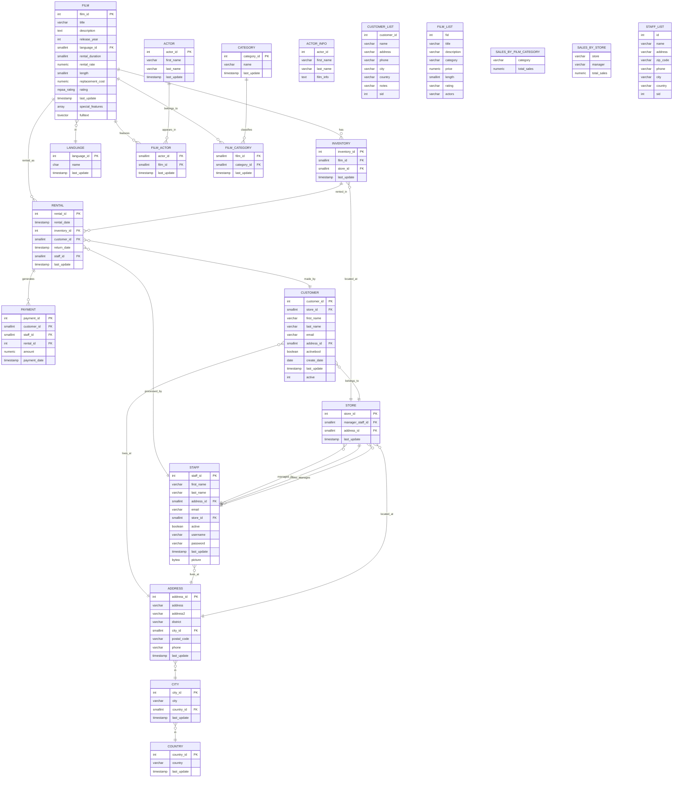

# DVD Rental Management System - ER Diagram

## Entity Relationship Diagram

## Key Features of the ER Diagram

### **Core Business Flow**
1. **Film → Inventory → Rental → Payment** - The main rental transaction flow
2. **Store → Staff → Customer** - Operational hierarchy
3. **Film ↔ Actor/Category** - Content classification system

### **Geographic Hierarchy**
- **Country → City → Address → Store/Customer/Staff** - Complete location tracking

### **Many-to-Many Relationships**
- **Film ↔ Actor** via `FILM_ACTOR` junction table
- **Film ↔ Category** via `FILM_CATEGORY` junction table

### **Analytical Views**
- **Business Intelligence**: Sales by category, sales by store
- **Customer Management**: Customer lists with full address information
- **Content Discovery**: Film lists with actor and category information
- **Staff Management**: Staff lists with store assignments

### **Data Integrity Features**
- **Foreign Key Constraints**: Maintains referential integrity
- **Audit Trails**: `last_update` timestamps on all tables
- **Status Tracking**: Active flags for customers and staff
- **Business Rules**: Default rental duration, pricing, and replacement costs

This ER diagram represents a comprehensive DVD rental management system designed for scalability, data integrity, and business intelligence.
