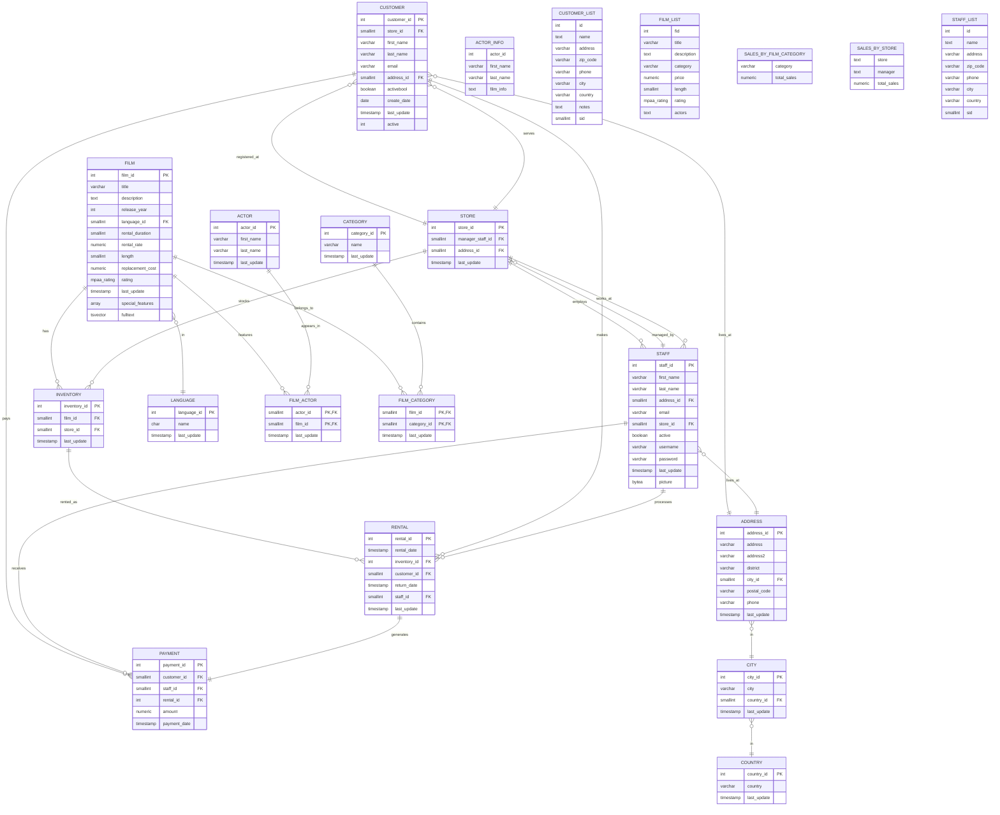

# DVD Rental Database - Entity Relationship Diagram

## ER Diagram

## Database Schema Summary

### **Core Business Flow**
1. **Film Management**: Films are categorized and feature actors
2. **Inventory**: Physical copies are distributed across stores
3. **Customer Operations**: Customers rent films from stores
4. **Rental Process**: Staff process rentals and payments
5. **Geographic Structure**: Addresses organized by city/country hierarchy

### **Key Relationships**
- **One-to-Many**: Store → Staff, Store → Customer, Store → Inventory
- **Many-to-Many**: Film ↔ Actor, Film ↔ Category
- **One-to-One**: Rental ↔ Payment
- **Hierarchical**: Country → City → Address

### **Business Rules**
- Each film can have multiple actors and categories
- Each store has one manager (staff member)
- Customers are associated with one store
- Rentals generate exactly one payment
- Inventory items are unique per store
- All entities maintain audit timestamps

### **View Tables Purpose**
- **Reporting Views**: Sales by category/store, customer/staff lists
- **Business Intelligence**: Aggregated data for management decisions
- **User Experience**: Simplified data access for common queries
