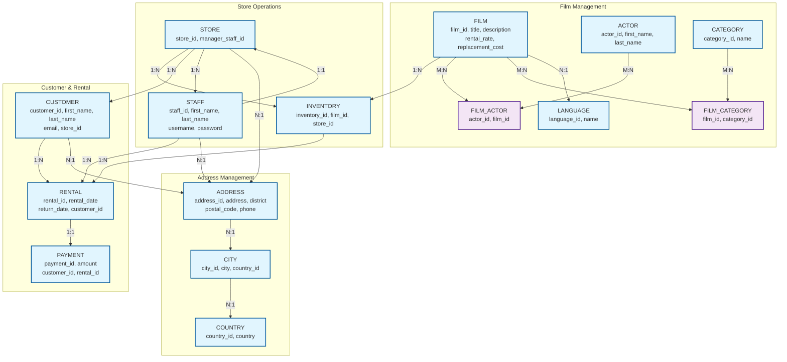
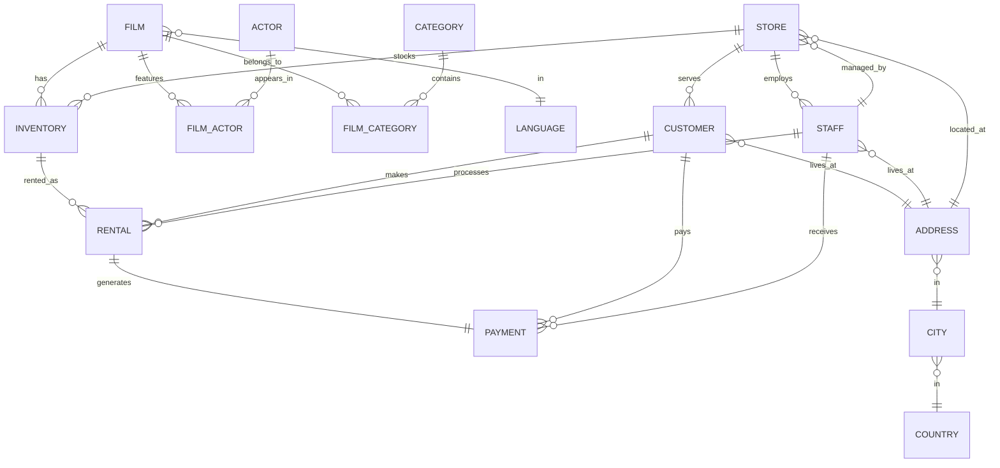

# DVD Rental Database - Visual ER Diagram

## Visual Entity Relationship Diagram

## Simplified ER Diagram (Core Tables Only)

## Database Schema Overview

### **Core Business Entities**

| Entity | Purpose | Key Attributes |
|--------|---------|----------------|
| **FILM** | Movie catalog | title, description, rental_rate, rating |
| **ACTOR** | Cast information | first_name, last_name |
| **CATEGORY** | Film genres | name |
| **LANGUAGE** | Available languages | name |
| **STORE** | Physical locations | manager_staff_id |
| **STAFF** | Store employees | username, password, store_id |
| **CUSTOMER** | Rental customers | first_name, last_name, email, store_id |
| **INVENTORY** | Physical copies | film_id, store_id |
| **RENTAL** | Rental transactions | rental_date, return_date |
| **PAYMENT** | Financial records | amount, payment_date |

### **Key Relationships**

1. **Film Management**
   - Films can have multiple actors (M:N via FILM_ACTOR)
   - Films can belong to multiple categories (M:N via FILM_CATEGORY)
   - Each film has one language

2. **Store Operations**
   - Each store has one manager (staff member)
   - Stores employ multiple staff members
   - Stores serve multiple customers
   - Stores stock multiple inventory items

3. **Rental Process**
   - Customers make multiple rentals
   - Staff process multiple rentals
   - Each rental generates one payment
   - Inventory items are rented multiple times

4. **Address Hierarchy**
   - Country → City → Address → Customer/Staff/Store
   - Geographic data is normalized for consistency

### **Business Rules & Constraints**

- **Referential Integrity**: All foreign keys maintain data consistency
- **Audit Trail**: Timestamp tracking on all major entities
- **Store Association**: Customers and staff are tied to specific stores
- **Inventory Management**: Physical copies tracked per store location
- **Payment Processing**: One-to-one relationship between rentals and payments
